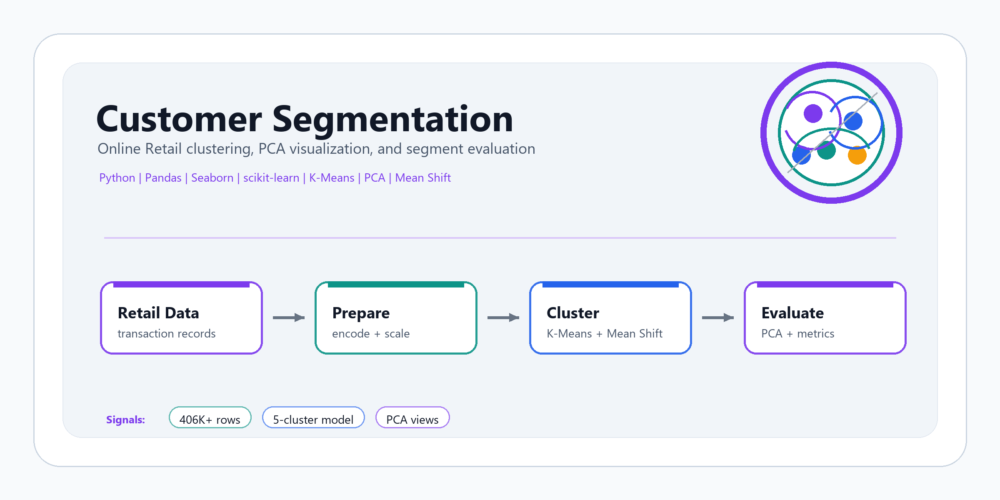
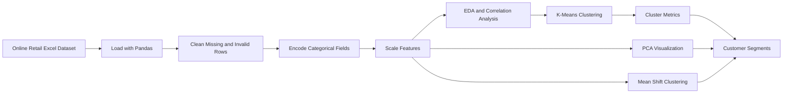

# Customer Segmentation

**Unsupervised machine learning analysis for Online Retail customer segmentation using Python, Pandas, Seaborn, scikit-learn, K-Means, PCA, and Mean Shift clustering.**

[GitHub profile](https://github.com/sntk-76)

## Overview

Customer Segmentation is a notebook-based analytics and machine learning project that groups customers from an Online Retail transaction dataset into behavioral segments. The project walks through the full segmentation workflow: data loading, cleaning, categorical encoding, normalization, exploratory analysis, clustering, dimensionality reduction, and model evaluation.

The goal is to transform raw transaction records into interpretable customer groups that can support marketing strategy, retention analysis, customer profiling, and business decision-making.

## Why This Project Matters

Customer segmentation is one of the most practical applications of unsupervised learning. Businesses often have transaction-level data but no predefined labels for customer types. Clustering helps discover natural structure in purchasing behavior, making it easier to target promotions, identify high-value groups, and understand customer diversity.

For recruiters and technical reviewers, this project demonstrates hands-on skill with real-world data preparation, feature scaling, clustering algorithms, PCA visualization, and cluster-quality evaluation.

## Core Capabilities

| Capability | Implementation |
| --- | --- |
| Transaction dataset loading | Reads the Online Retail Excel dataset into Pandas. |
| Data cleaning | Drops missing values and removes invalid negative-quantity records. |
| Categorical encoding | Uses `LabelEncoder` for invoice, product, customer, country, and date-related fields. |
| Feature scaling | Applies `MinMaxScaler` with a `1` to `5` range for clustering-ready features. |
| Exploratory analysis | Uses histograms, pair plots, and correlation heatmaps to inspect distributions and relationships. |
| K-Means clustering | Evaluates cluster counts from `k=2` to `k=11` and trains a 5-cluster model. |
| Cluster evaluation | Compares Silhouette Score, Calinski-Harabasz Score, Davies-Bouldin Score, and WCSS. |
| PCA visualization | Reduces feature space for 2D and 3D cluster visualization and explained-variance analysis. |
| Mean Shift clustering | Applies density-based clustering on a sampled subset for algorithm comparison. |

## Analysis Workflow



## Technical Stack

| Layer | Tools |
| --- | --- |
| Language | Python |
| Notebook environment | Jupyter Notebook |
| Data handling | Pandas, NumPy |
| Visualization | Matplotlib, Seaborn |
| Preprocessing | LabelEncoder, MinMaxScaler |
| Clustering | K-Means, Mean Shift |
| Dimensionality reduction | PCA |
| Evaluation | Silhouette, Calinski-Harabasz, Davies-Bouldin, WCSS |

## Repository Structure

```text
Customer-Segmentation/
|-- assets/
|   `-- customer-segmentation-cover.png
|-- customer-segmentation (1).ipynb   # Main analysis notebook
|-- requirements.txt
|-- LICENSE
`-- README.md
```

## Dataset

The notebook uses the Online Retail dataset, a transaction-level dataset for a UK-based online retail business. The expected fields include:

- `InvoiceNo`
- `StockCode`
- `Description`
- `Quantity`
- `InvoiceDate`
- `UnitPrice`
- `CustomerID`
- `Country`

The dataset is not committed in this repository. The notebook currently references a Kaggle path:

```python
pd.read_excel('/kaggle/input/customer-segmentation-dataset/Online Retail.xlsx')
```

To run the project locally, download the dataset and update the notebook path accordingly.

## Preprocessing

The notebook prepares the dataset by:

1. Loading the Excel file with Pandas.
2. Removing rows with missing values.
3. Encoding categorical fields with `LabelEncoder`.
4. Dropping `InvoiceDate` after encoding and transformation steps.
5. Removing records with negative `Quantity`.
6. Scaling all remaining features with `MinMaxScaler(feature_range=(1, 5))`.
7. Creating a normalized DataFrame for clustering.

## Exploratory Data Analysis

The EDA section includes:

- Histograms for feature distributions.
- Pair plots on a sampled subset.
- Correlation heatmap for normalized features.
- PCA scatter plot for two-dimensional structure inspection.
- Feature-level distribution plots with KDE curves.

## Clustering and Evaluation

The project evaluates K-Means over multiple cluster counts:

```python
k_value = [i for i in range(2, 12)]
```

For each value of `k`, the notebook computes:

- WCSS for elbow-method inspection.
- Silhouette Score.
- Calinski-Harabasz Score.
- Davies-Bouldin Score.

The final K-Means model uses:

```python
KMeans(n_clusters=5, random_state=0)
```

The notebook also applies PCA for visualizing cluster structure and Mean Shift clustering on a sampled subset of the normalized data.

## Running Locally

```bash
git clone https://github.com/sntk-76/Customer-Segmentation.git
cd Customer-Segmentation

python -m venv .venv
.venv\Scripts\activate
pip install -r requirements.txt
```

On macOS/Linux, activate the environment with:

```bash
source .venv/bin/activate
```

Then open the notebook:

```bash
jupyter notebook "customer-segmentation (1).ipynb"
```

Before running all cells, place the Online Retail Excel file locally and update the `pd.read_excel(...)` path in the notebook.

## Project Highlights

- Demonstrates a full unsupervised learning workflow on transactional retail data.
- Uses both centroid-based and density-based clustering approaches.
- Applies multiple cluster-quality metrics instead of relying on a single visual heuristic.
- Uses PCA for lower-dimensional inspection of high-dimensional customer records.
- Connects customer analytics with practical marketing and business segmentation use cases.

## Future Improvements

- Engineer stronger business features such as recency, frequency, monetary value, average basket size, and return rate.
- Replace label-encoded identifiers with customer-level behavioral aggregates.
- Export cluster profiles with descriptive business names.
- Add visual cluster summaries and segment-level KPI tables.
- Convert the notebook into a reproducible Python pipeline.
- Build an interactive dashboard for exploring segment behavior.

## License

This project is licensed under the [MIT License](LICENSE).
